# 🎁 Hướng dẫn sử dụng Poké Gacha Picker

Poké Gacha Picker là một trò chơi quay số trên web. Bạn liệt kê các món quà Pokémon muốn mua, web sẽ **quay ngẫu nhiên** giúp bạn thành 3 "giỏ quà" (gọi là **batch**), rồi bạn chọn giỏ ưng ý nhất.

Không cần cài đặt gì. Chỉ cần điện thoại hoặc máy tính có trình duyệt (Chrome, Safari, Edge…).

---

## 🔗 Mở web ở đâu?

Mở đường link mà người quản lý gửi cho bạn, có dạng:

> **https://&lt;tên-web&gt;.vercel.app**

Mẹo: sau khi mở, hãy **lưu trang vào Bookmark**, hoặc trên điện thoại chọn **"Thêm vào màn hình chính"** để lần sau mở nhanh.

---

## 📜 Luật chơi trong 30 giây

| | |
|---|---|
| 🎁 **Danh sách quà** | Bạn nhập từ **1 đến 100 món**. Mỗi món gồm: tên, giá (yên), loại, link bán, số lượng. |
| 🚫 **Không trùng** | Không được có 2 món cùng **tên + link + loại**. |
| 🧺 **Batch** | Mỗi lần quay trúng 1 món và món đó vào giỏ. Một giỏ hợp lệ có tổng tiền **từ 3,000¥ đến dưới 5,000¥**. |
| 📦 **Số lượng** | Một món chỉ trúng được **tối đa bằng số lượng** bạn nhập, trong **mỗi** giỏ. Sang giỏ mới thì số lượng đầy lại. |
| 🎯 **Cơ hội trúng** | Món còn nhiều số lượng thì **dễ trúng hơn**. |
| 🎟 **3 lượt** | Mỗi tài khoản có đúng **3 batch**. |
| 🏆 **Kết thúc** | Quay xong 3 batch, bạn **chọn 1 batch** làm kết quả cuối. Sau đó tài khoản không quay thêm được nữa, chỉ xem lại lịch sử. |

---

## Bước 1: Tạo tài khoản

1. Mở web, bạn sẽ thấy màn hình **Đăng nhập**. Nếu chưa có tài khoản, bấm **"Đăng ký ngay"** ở dưới cùng.

   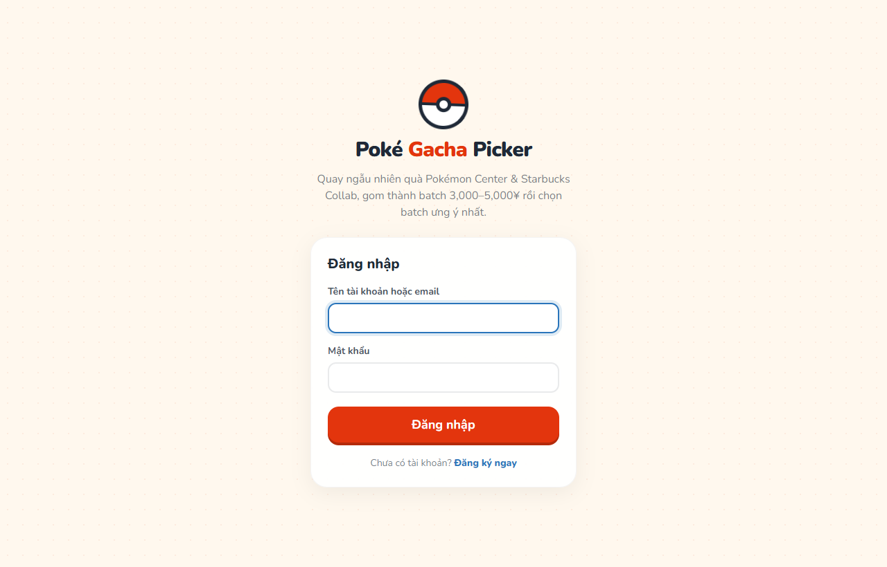

2. Điền thông tin:
   - **Tên tài khoản**: 3–20 ký tự, chỉ gồm chữ không dấu, số và các dấu `_` `.` `-`. Ví dụ: `ash_ketchum`.
   - **Email**: không bắt buộc. Nếu điền thì lần sau có thể đăng nhập bằng email.
   - **Mật khẩu**: ít nhất 6 ký tự, rồi nhập lại lần nữa cho chắc.

   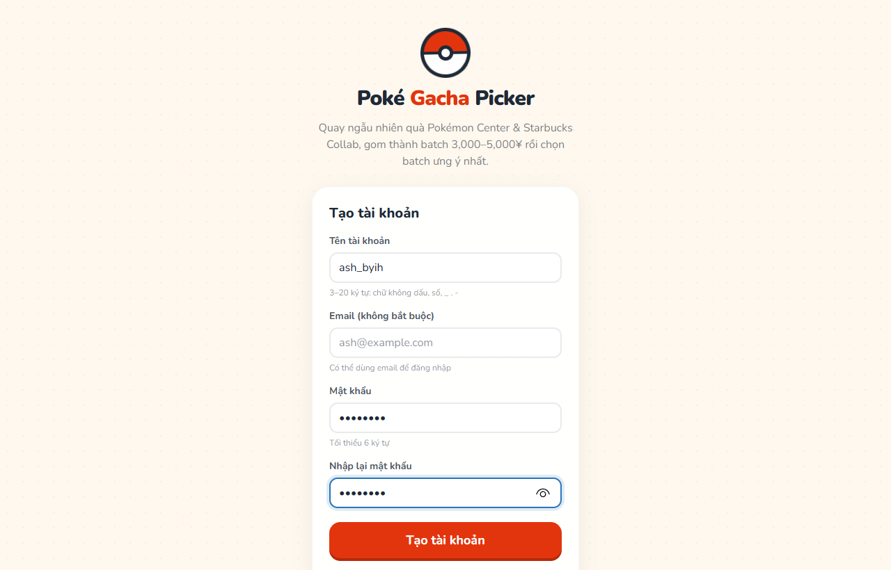

3. Bấm **"Tạo tài khoản"**.

> ⚠️ **Hãy nhớ kỹ mật khẩu.** Web không có chức năng "Quên mật khẩu".

## Bước 2: Đăng nhập

Tạo tài khoản xong, web tự quay về màn hình đăng nhập và điền sẵn tên tài khoản. Bạn chỉ cần nhập mật khẩu rồi bấm **"Đăng nhập"**.

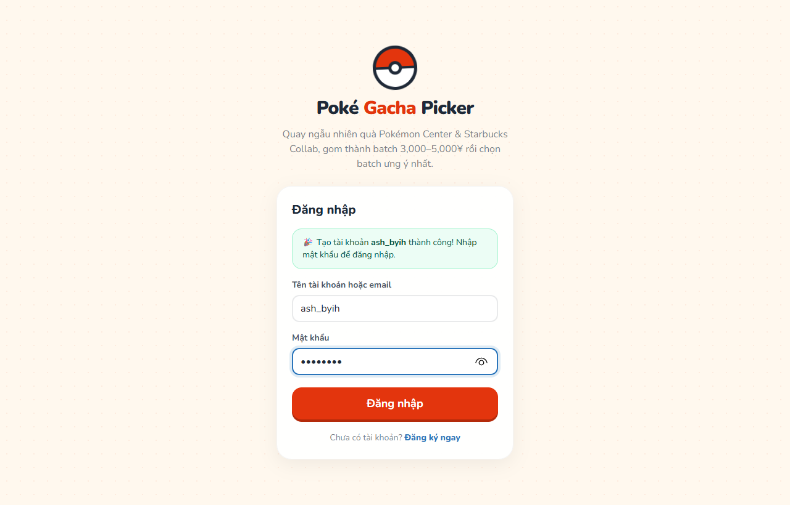

Lần sau bạn đăng nhập bằng **tên tài khoản hoặc email** cùng mật khẩu. Không phân biệt chữ hoa, chữ thường ở tên tài khoản.

---

## Bước 3: Nhập danh sách quà

Có 2 cách, dùng kết hợp cũng được.

### Cách 1: Nhập từng món

Điền vào khung **"Thêm item"** bên trái rồi bấm **"Thêm vào danh sách"**:

| Ô | Điền gì | Ví dụ |
|---|---|---|
| **Tên item** | Tên món quà | `Pikachu Plush` |
| **Đơn giá (¥)** | Giá tiền yên, chỉ số, từ 1 đến 4,999 | `1800` |
| **Số lượng** | Số lần tối đa món này được trúng trong 1 batch (mặc định 1) | `2` |
| **Category** | Chọn *Pokemon Center* hoặc *Pokemon Starbucks Collab* | |
| **Link website bán** | Địa chỉ trang bán, bắt đầu bằng `https://` | `https://www.pokemoncenter-online.com/...` |

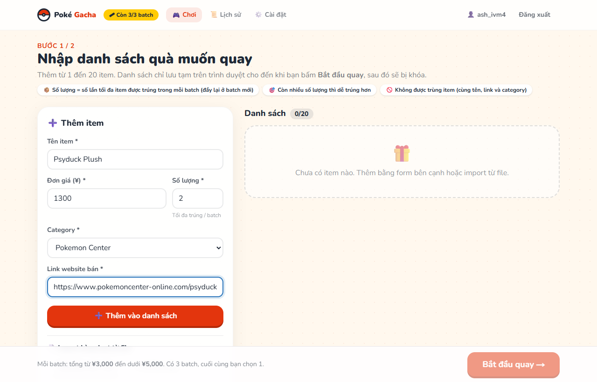

Nếu điền thiếu hoặc sai, chữ đỏ sẽ hiện ngay dưới ô đó để bạn sửa.

**Món bị trùng:** nếu món mới có cùng **tên, link và category** với một món đã có trong danh sách, web sẽ không cho thêm. Web không phân biệt chữ hoa, chữ thường khi so trùng.

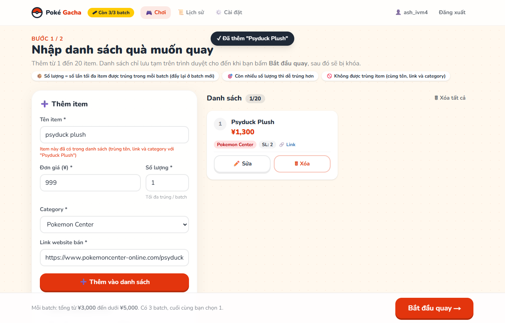

### Cách 2: Nhập nhiều món cùng lúc bằng file

Cách này tiện khi bạn có sẵn danh sách dài.

1. Bấm **"⬇ Tải file mẫu"** trong khung "Import hàng loạt từ file", hoặc dùng file [mau-danh-sach.csv](docs/huong-dan/mau-danh-sach.csv).
2. Mở file bằng **Excel** hoặc **Google Sheets** và điền mỗi món một dòng:

   | name | price | category | url | quantity |
   |---|---|---|---|---|
   | Pikachu Plush | 1800 | Pokemon Center | https://… | 1 |
   | Eevee Tumbler, Sakura | 2200 | Pokemon Starbucks Collab | https://… | 2 |

   - **Giữ nguyên dòng tiêu đề** `name, price, category, url, quantity`.
   - **price**: chỉ ghi số, không ghi `¥` hay dấu phẩy. Ví dụ `2500`, không ghi `¥2,500`.
   - **category**: ghi đúng một trong hai: `Pokemon Center` hoặc `Pokemon Starbucks Collab`.
   - **quantity**: có thể để trống, web sẽ hiểu là 1.
3. Lưu file:
   - **Excel**: *File → Save As → chọn kiểu* **CSV UTF-8 (Comma delimited) (\*.csv)**.
   - **Google Sheets**: *File → Download → Comma-separated values (.csv)*.
4. Quay lại web, bấm **"Chọn file .csv / .txt"** và chọn file vừa lưu.

> ⚠️ **Chỉ cần 1 dòng sai là cả file bị từ chối.** Web sẽ liệt kê dòng nào sai và sai ở đâu, bạn sửa rồi chọn lại file. Dòng bị trùng nhau, hoặc trùng món đã có trên màn hình, cũng tính là sai.

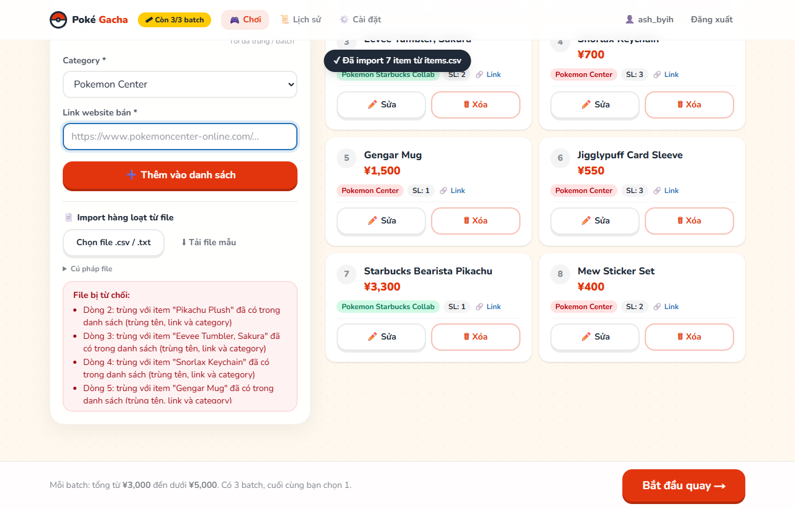

### Sửa hoặc xóa món

Mỗi món trong danh sách có nút **✏️ Sửa** và **🗑 Xóa**. Góc trên có bộ đếm, ví dụ **8/100**, cho biết bạn đã nhập bao nhiêu món.

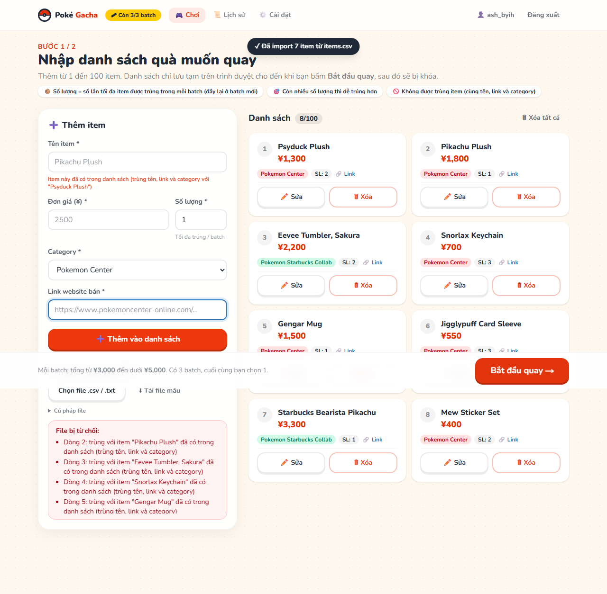

Danh sách được **lưu tạm trên trình duyệt** của bạn. Lỡ tắt trang thì mở lại vẫn còn, miễn là dùng cùng máy và cùng trình duyệt.

---

## Bước 4: Bắt đầu quay

Khi danh sách đã ổn, bấm nút đỏ **"Bắt đầu quay →"** ở cuối màn hình rồi bấm **"Chốt danh sách & quay"**.

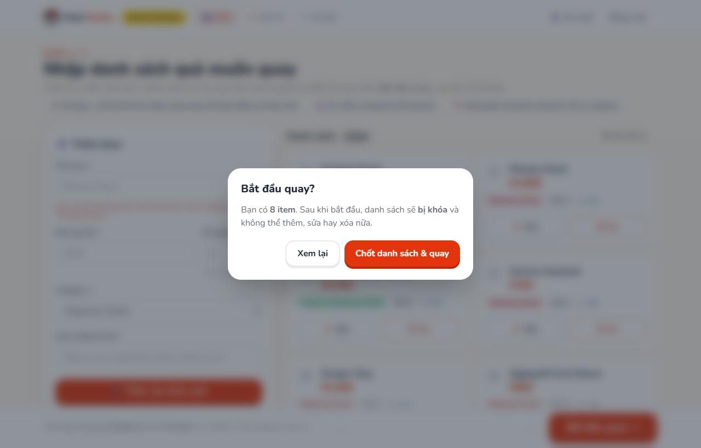

> ⚠️ Sau bước này, **danh sách bị khóa**. Bạn không thể thêm, sửa hay xóa món nào nữa, nên hãy kiểm tra kỹ trước khi bấm.

---

## Bước 5: Quay

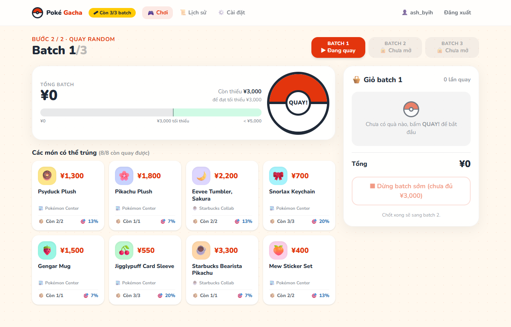

Cách đọc màn hình:

- **Tổng batch**: tổng tiền trong giỏ hiện tại. Thanh màu đầy dần; vạch ở giữa là mốc **3,000¥**, đầu bên phải là giới hạn **5,000¥**.
- **Các thẻ quà**: mỗi thẻ có icon, giá, tên và:
  - **📦 Còn x/y**: còn trúng được x lần nữa trong batch này, trên tổng y.
  - **🎯 %**: cơ hội trúng ở lần quay tới.
  - **×2** (góc đỏ): món này đã trúng 2 lần trong batch này.
  - Thẻ **mờ đi** nghĩa là lần này không thể trúng món đó, vì **"Hết lượt"** (đã trúng đủ số lượng) hoặc **"Vượt ngân sách"** (thêm vào sẽ thành từ 5,000¥ trở lên).
- **Giỏ batch**: bên phải trên máy tính, ở cuối trang trên điện thoại. Liệt kê các món đã trúng và tổng tiền.

Bấm nút Pokéball **"QUAY!"**. Ô sáng chạy qua các thẻ rồi dừng ở món trúng, Pokéball mở ra cho bạn xem kết quả:

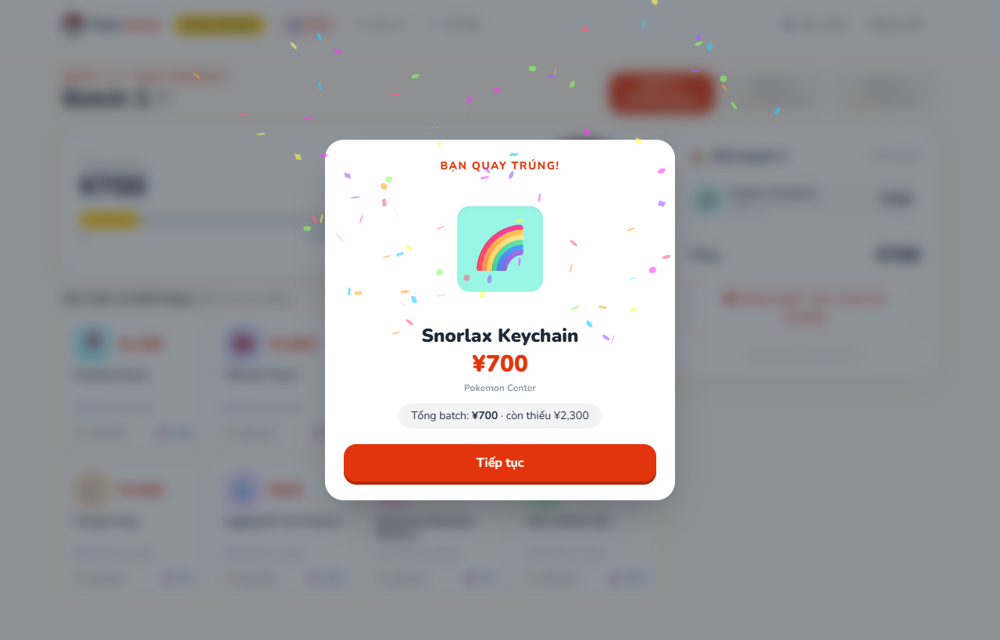

---

## Bước 6: Chốt batch hoặc dừng sớm

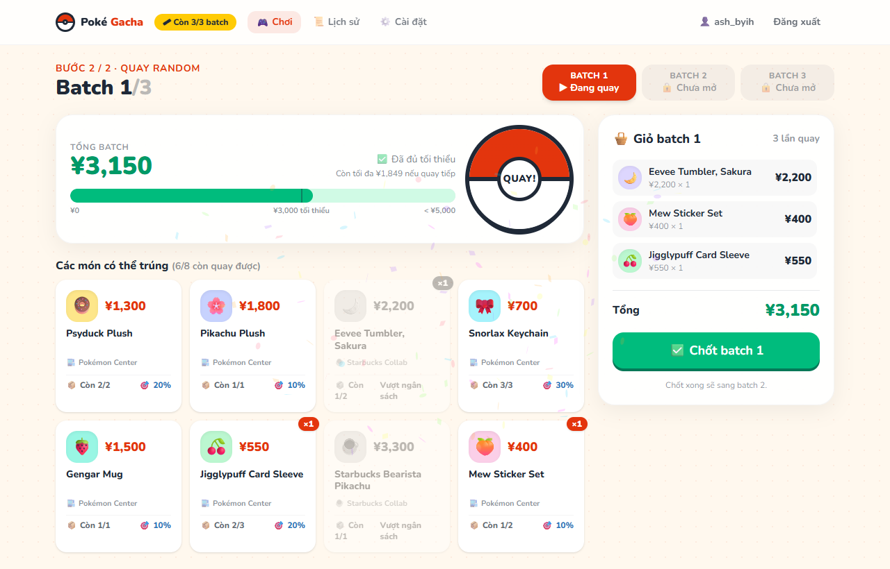

- **Khi tổng đạt từ 3,000¥**: nút xanh **"✅ Chốt batch"** xuất hiện, cả trong giỏ lẫn ngay trên cửa sổ kết quả. Bạn có thể chốt luôn, hoặc quay tiếp nếu vẫn còn món vừa ngân sách.
- **Khi chưa đủ 3,000¥ mà muốn dừng**: bấm **"⏹ Dừng batch sớm"** rồi **"Đồng ý dừng"**. Batch đó vẫn được giữ, chỉ được đánh dấu "chưa đủ 3,000¥".

  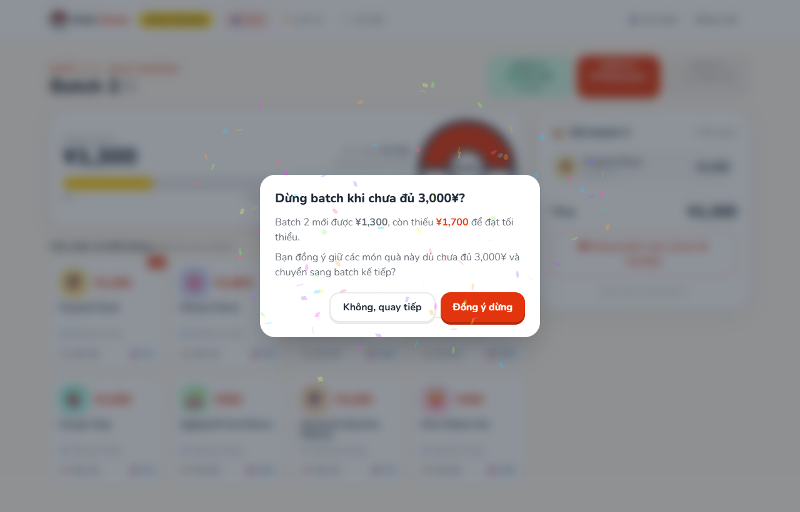

- **Khi không còn món nào quay được**: web sẽ báo, và bạn chỉ cần chốt hoặc dừng.

Chốt xong một batch, web chuyển sang batch tiếp theo và **số lượng của mọi món đầy lại**. Góc trên màn hình luôn hiện **"🎟 Còn x/3 batch"**.

Trên điện thoại, màn hình tự sắp xếp lại cho dễ bấm:

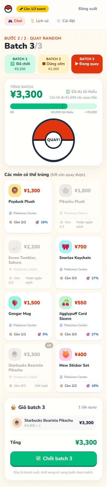

---

## Bước 7: Chọn batch cuối cùng

Sau batch thứ 3, web hiện cả 3 batch cạnh nhau. Mỗi batch ghi từng món, số lần trúng (SL), đơn giá, thành tiền và tổng tiền.

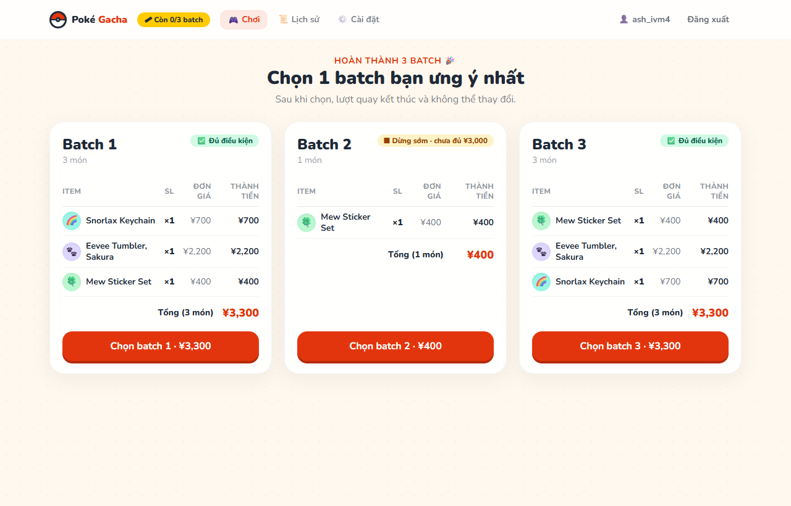

Bấm **"Chọn batch …"** dưới batch bạn thích nhất rồi **"Xác nhận chọn"**.

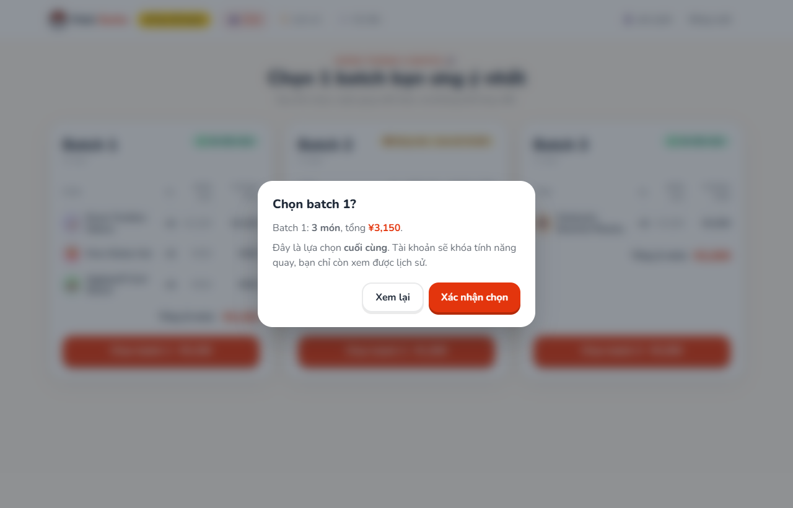

> ⚠️ Đây là lựa chọn **cuối cùng**, không đổi lại được.

---

## Xem lại kết quả: Lịch sử

Bấm **"📜 Lịch sử"** trên thanh menu. Batch bạn chọn nằm trên cùng, có viền vàng 🏆. **Bấm vào tên món để mở trang bán** và mua. Phía dưới là các batch còn lại và chi tiết từng lần quay.

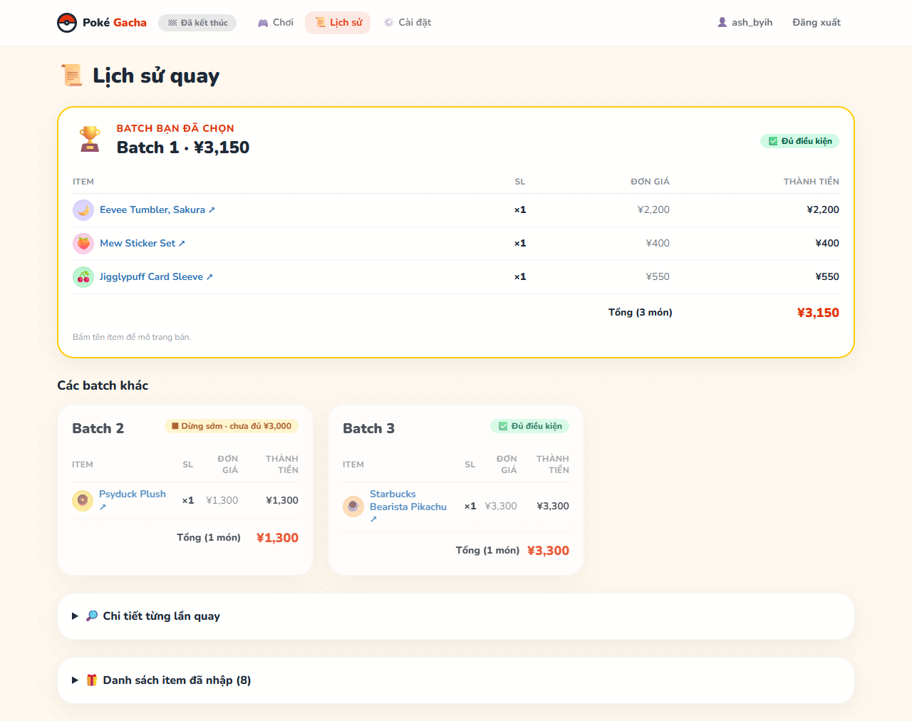

## Cài đặt và Đăng xuất

Trong **"⚙️ Cài đặt"**, bạn có thể thêm, đổi hoặc xóa email và đổi mật khẩu (cần nhập mật khẩu hiện tại). Nút **"Đăng xuất"** nằm ở góc trên bên phải.

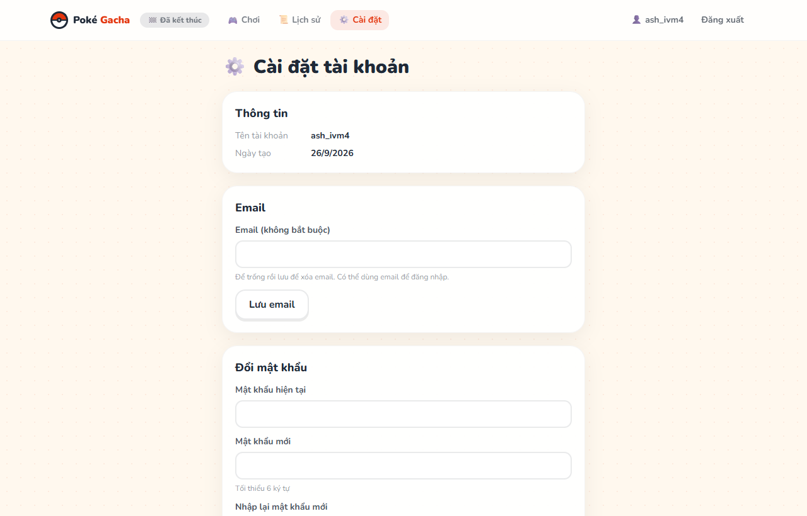

---

## ❓ Câu hỏi thường gặp

**Đang quay mà lỡ tắt web, hết pin hoặc mất mạng thì sao?**
Không sao cả. Mỗi lần quay được lưu ngay. Bạn đăng nhập lại là tiếp tục đúng chỗ đang dừng, kết quả cũ vẫn giữ nguyên.

**Tải lại trang (F5) có quay lại được để đổi kết quả không?**
Không. Kết quả được quyết định và lưu ngay khi bạn bấm quay.

**Vì sao có món bị mờ, không bao giờ trúng?**
Vì món đó đã trúng đủ số lượng trong batch này, hoặc thêm món đó vào sẽ làm tổng tiền đạt từ 5,000¥ trở lên.

**Vì sao món A dễ trúng hơn món B?**
Món còn nhiều số lượng thì có nhiều "phiếu bốc thăm" hơn. Ví dụ A còn 2, B còn 1 thì A có cơ hội gấp đôi B. Con số 🎯 % trên mỗi thẻ cho biết cơ hội chính xác.

**Quên mật khẩu thì làm sao?**
Web không có chức năng lấy lại mật khẩu. Hãy liên hệ người quản lý web.

**Chơi xong 3 batch rồi, có chơi lại được không?**
Không. Mỗi tài khoản chỉ có 1 lượt gồm 3 batch. Sau khi chọn batch, bạn vẫn đăng nhập để xem Lịch sử bất cứ lúc nào.

**Đăng nhập báo "Sai tên tài khoản/email hoặc mật khẩu"?**
Kiểm tra lại mật khẩu (có phân biệt chữ hoa, chữ thường) và xem có đang bật Caps Lock không. Nếu chắc chắn đúng mà vẫn lỗi, hãy liên hệ người quản lý.

**Import file bị báo lỗi dù nhìn thấy đúng?**
Hay gặp nhất là: sửa mất dòng tiêu đề; ghi giá kiểu `¥2,500` hoặc `2,500`; gõ sai tên category; hai dòng trùng nhau. Nếu tên có chữ Nhật hay chữ Việt bị lỗi font, hãy lưu lại bằng kiểu **CSV UTF-8**.
